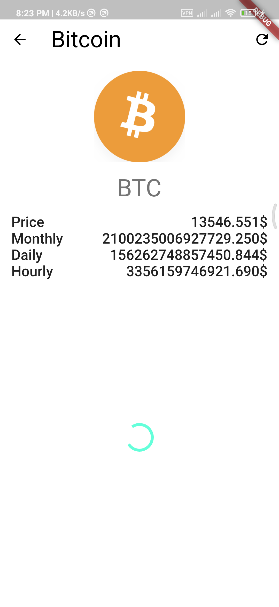

# CryptoList

A Flutter application to show cryptocurrency prices.

If you want to clone this project create a [CoinAPI](https://rest.coinapi.io) API key and set it to `_apiKey` variable in file `data/remote/service.dart`.

If you press cryptocurrency icon in it's dedicated page it will search google about it.

